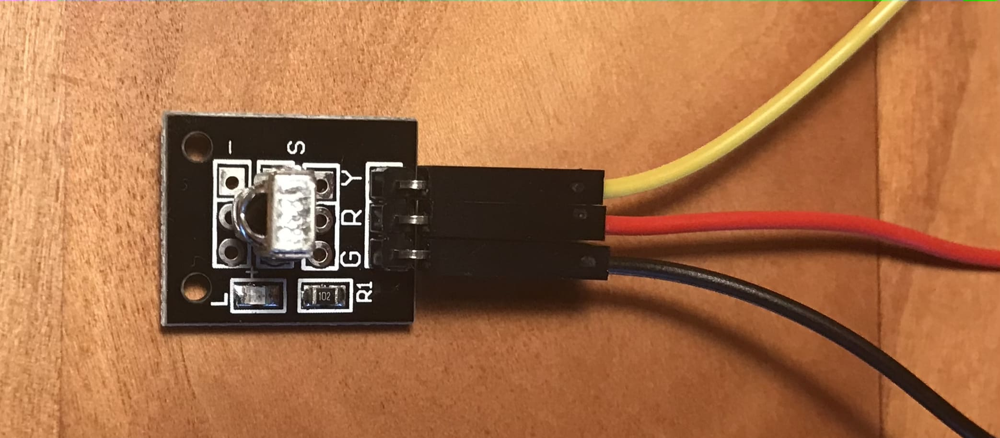
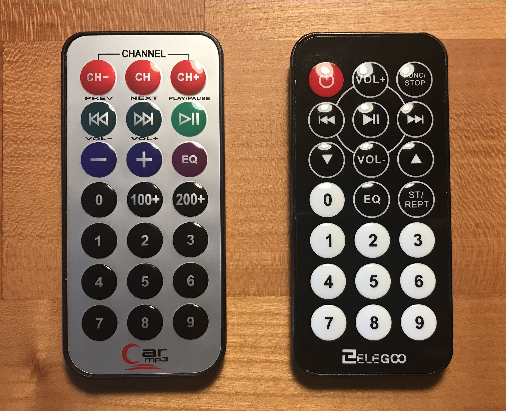

# Infrared Remote

The IR-Receiver-Breakout-Board has three input connections:

Black = Ground, Red = VCC (5V), Yellow = Signal (here: connected to PIN 11)

There are **two different remotes**: A **silver** one and a **black** one.

The connection is the same and even the signals for the same keys are the same. However both have unique keys (e.g. Power vs. Channel).

The only difference in the code is the **translation table** implemented using an `enum`.

